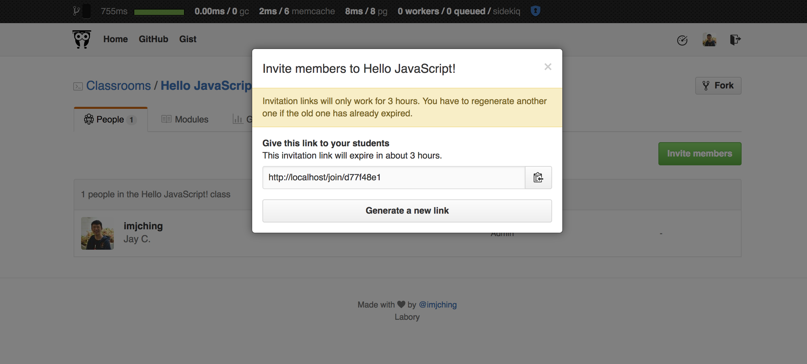

## Labory

An online learning management system for programming bootcamps and workshops that allows instructors to create modules and labs so that students could enroll into classes and work on challenges. 

Built just to explore with Docker (https://imjching.com/writings/2016/03/04/docker-ruby-experiment/). 

Stack: Ruby on Rails, HTML5, SCSS, JavaScript/CoffeeScript, Gulp, Bower, Docker.

It's not complete. Plan to rebuild with Rails 5.0.

Inspired by GitHub Classroom: https://github.com/education/classroom

* Instructors create classrooms.
* Classrooms can have many labs.
* Labs can be created beforehand and their display settings can be altered to show/hide from students.

### Instructors could invite students to join the classroom

### Instructors could create modules

### Labs are created using Markdown syntax with real-time markdown preview

### How a lab looks like to students

